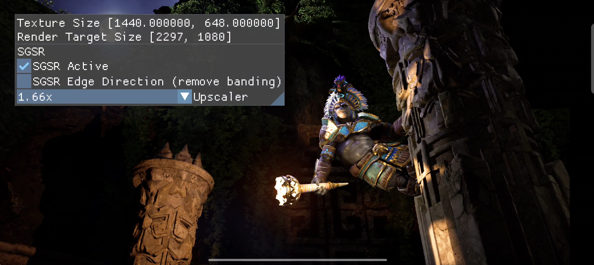

# Snapdragon™ Game Super Resolution



## Overview

This sample demonstrates how to use the [Snapdragon™ Game Super Resolution](https://github.com/quic/snapdragon-gsr) and offers a comparison with the traditional *Bilinear Interpolation*.

- Toggle **SGSR Active** to activate Snapdragon™ GSR
- Toggle **SGSR Edge Direction** to use an optional edge direction calculation on the SGSR shader that helps reducing banding

## Building

### Dependencies

The following dependencies must be installed and the appropriate locations should be referenced in the `PATH` environment variable.

* Android SDK
* Andorid NDK
* Gradle
* CMake
* Android Studio

### Pre-Build

Compile the underlying shaders to .spv by running the batch file below:

```
01_CompileShaders.bat
```

And convert the needed textures to the correct format using the batch file below:

```
02_PrepareMedia.bat
```

### Build

Once the dependencies are installed and shaders compiled, building this sample .apk/.exe is as simple as running any of the batch files from the framework root directory, accordingly to your target system:

```
01_BuildAndroid.bat
02_BuildWindows.bat
```

### Deploy (android-only)

To deploy the media files and the .apk to a connected device, run the batch file below:

```
03_Install_APK.bat
```

Optionally you can change the default configurations for this sample by upating the file **app_config.txt** and running the batch file below:

```
04_InstallConfig.bat
```

## Android Studio

This sample can also be easily imported to Android Studio and be used within the Android Studio ecosystem including building, deploying, and native code debugging.

To do this, open Android Studio and go to `File->New->Import Project...` and select the `project\android` folder as the source for the import. This will load up the gradle configuration and once finalized, the sample can be used within Android Studio.
